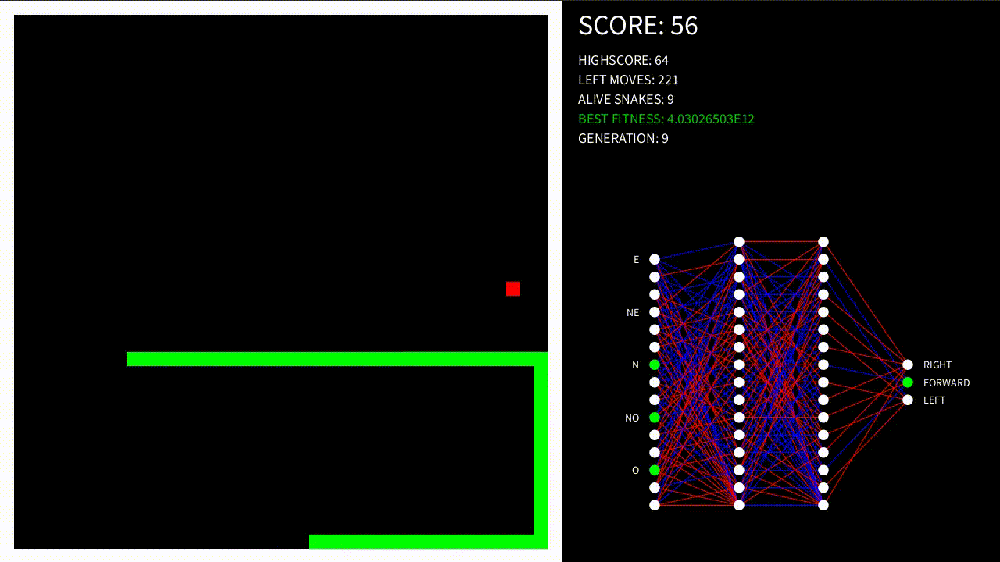

# SnakeAi
AI learns to play the famous Snake game through a genetic algorithm.

## Snake

### Neural Network
The *brain* of a snake is a neural network composed of 3 layers with 16, 16 and 3 neurons respectively, which takes 15 inputs and assigns them to one of three possible outputs providing the direction that the snake should take: turn to the left, continue forward or turn to the right, in this specific order.

### Vision
The inputs of the neural network are collected on each frame and they correspond to the vision of the snake. Indeed, the snake takes 3 different informations from 5 possible directions:
- Inverse distance to the wall
- Inverse distance to the body/tail
- Presence of food

The directions are calculated starting from the orientation of the snake, in order to cover a field of view of 180 degrees.

## Genetic Algorithm

### Natural Selection
Each generation consists of 2000 snakes resulting from a combination of the best ones taken from the previous generation. The first generation starts with snakes having a brain that is a randomly initialized neural network. When all the snakes are dead, the algorithm calculates their ***fitnesses*** and selects the best one which is immediately added in the new generation of snakes, while its performance is shown on the screen. For each of the remaining, the algorithm randomly chooses two parent snakes, with a probability which depends on their fitnesses, to generate a child snake with a brain resulting from the ***crossover*** between its parents brains and the following ***mutation***.

### Fitness Function
The fitness function used for this algorithm depends on the score achieved by the snake and its lifetime. When the score is less than 10 it is equal to $2^{score} \cdot lifetime^2$, otherwise it equals $2^{10} \cdot lifetime^2 \cdot (score-9)$. 

### Crossover
The crossover allows the generation of a snake starting from two. In this project, the crossover function combines a more or less large portion of the weights of one snake's neural network with the other portion of weights from the second snake's neural network. The sizes of the two portions of weights are randomly chooses each time.

### Mutation
The mutation consists of a slight change of the weights of a snake's neural network relying on a given mutation rate, which is 5% for this project. To perform the mutation, an algorithm sums to each weight a small constant which is randomly generated based on a gaussian distribution of the probabilities.

### Spin Issue
Due to the fact that the fitness function also rewards the snakes which live longer, it might happen that a snake gets stuck into a continuous spin. To prevent this kind of issues, I've limited the number of moves that a snake could make. Each snake starts with 200 moves which are increased by 100 every time it reaches the food, but only if it has less than 500 moves left or if its score is above 40 (in order to give more opportunities to snakes with longer tails). Moreover, if a snake reaches the food and has less than 100 moves left it will receive an extra of 50 moves in order to extend its life.